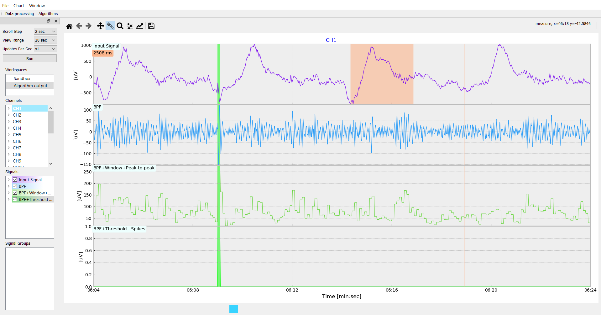
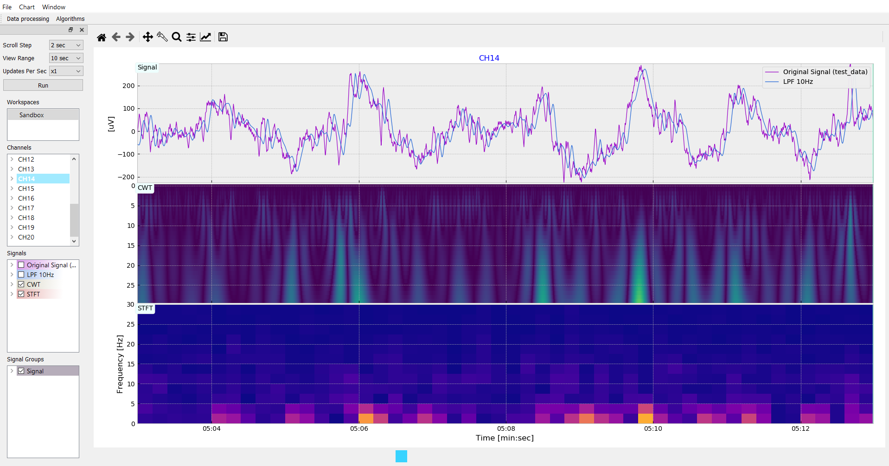

# ECoG_Analyzer
Application for visual ECoG/EEG signal analysis
## About
Supported files:
- *.mat
- *.edf

Available operations:
- Filtering
- Average
- Energy
- Power
- Peak-To-Peak
- Variance
- Entropy
- Skewness
- Thresholding
- Detrend
- STFT
- CWT
## Screenshots

